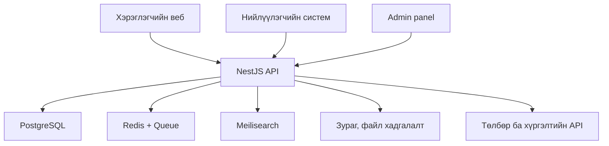
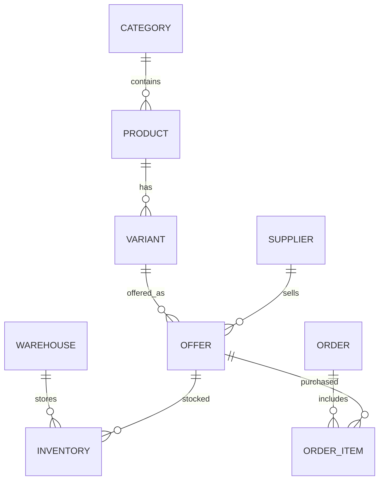

# barilgaHUB — Барилгын материалын e-commerce платформын архитектур

## 1. Архитектурын үндсэн шийдэл

Олон нийлүүлэгчтэй барилгын материалын marketplace-ийг эхний хувилбараас microservice болгохын оронд **modular monolith** архитектураар хөгжүүлэх нь тохиромжтой. Ингэснээр хөгжүүлэлт хурдан, сервер болон засвар үйлчилгээний зардал бага байх бөгөөд хэрэглэгч, захиалга өсөх үед шаардлагатай модулиудыг тусдаа service болгон салгах боломжтой.

## 2. Санал болгох технологийн бүтэц

| Хэсэг | Технологи | Зориулалт |
|---|---|---|
| Хэрэглэгчийн веб | Next.js + TypeScript | Каталог, хайлт, сагс, захиалга |
| Нийлүүлэгчийн систем | Next.js | Бараа, үнэ, үлдэгдэл, захиалга удирдах |
| Admin panel | Next.js | Нийлүүлэгч батлах, шимтгэл, тайлан |
| Backend API | NestJS + TypeScript | Бизнес логик, API, эрхийн удирдлага |
| Үндсэн өгөгдлийн сан | PostgreSQL | Бараа, захиалга, төлбөр, хэрэглэгч |
| Cache / Queue | Redis + BullMQ | Cache, мэдэгдэл, тайлан, background job |
| Барааны хайлт | Meilisearch | Түргэн хайлт, filter, үнэ эрэмбэлэлт |
| Зураг, файл | S3-compatible storage | Барааны зураг, invoice, баримт |
| Төлбөр | QPay болон банкны API | Төлбөр хүлээн авах |
| Байршил | Google Maps эсвэл Mapbox | Агуулах, хүргэлтийн хаяг |
| Deployment | Docker + Cloudflare + VPS/Cloud | Сервер байршуулалт |

## 3. Ерөнхий архитектур



## 4. Frontend бүтэц

### 4.1 Худалдан авагчийн веб

```text
frontend/storefront
├── нүүр
├── ангилал
├── хайлт
├── бүтээгдэхүүний дэлгэрэнгүй
├── үнэ ба нийлүүлэгчийн харьцуулалт
├── сагс
├── төлбөр
├── захиалгын түүх
├── хүргэлт хянах
└── байгууллагын худалдан авалт
```

Бүтээгдэхүүний хуудас дээр нэг материалын доор олон нийлүүлэгчийн санал харагдана:

- Нийлүүлэгч
- Нэгж үнэ
- Бөөний үнэ
- Үлдэгдэл
- Агуулахын байршил
- Хүргэлтийн үнэ
- Хүргэх хугацаа
- Баталгаажсан эсэх
- Үнэлгээ

### 4.2 Нийлүүлэгчийн dashboard

```text
frontend/supplier
├── бараа нэмэх
├── Excel-ээр бөөнөөр оруулах
├── үнэ шинэчлэх
├── үлдэгдэл удирдах
├── агуулах
├── захиалга
├── хүргэлт
├── борлуулалтын тайлан
├── шимтгэлийн тооцоо
└── төлбөр татан авах
```

### 4.3 Admin panel

```text
frontend/admin
├── хэрэглэгч
├── нийлүүлэгч
├── бүтээгдэхүүн баталгаажуулах
├── ангилал ба үзүүлэлт
├── захиалга
├── төлбөр
├── буцаалт, маргаан
├── хүргэлт
├── 2%-ийн шимтгэл
├── сурталчилгаа
└── тайлан, аналитик
```

## 5. Backend модулиуд

```text
backend/src/modules
├── auth
├── users
├── suppliers
├── organizations
├── categories
├── attributes
├── products
├── product-variants
├── offers
├── inventory
├── warehouses
├── search
├── carts
├── orders
├── payments
├── commissions
├── deliveries
├── reviews
├── notifications
├── promotions
├── disputes
└── reports
```

Эдгээр нь эхний шатанд нэг backend дотор ажиллана. Ачаалал нэмэгдвэл `search`, `payment`, `delivery`, `notification` модулиудыг тусдаа service болгон салгаж болно.

## 6. Database-ийн үндсэн загвар



### Гол table-ууд

| Table | Үүрэг |
|---|---|
| `users` | Хэрэглэгч, нийлүүлэгч, админ |
| `suppliers` | Нийлүүлэгч байгууллага |
| `categories` | Ангилал, дэд ангилал |
| `products` | Бүтээгдэхүүний үндсэн мэдээлэл |
| `product_variants` | Хэмжээ, өнгө, зузаан, марк |
| `offers` | Нийлүүлэгч бүрийн үнэ, нөхцөл |
| `warehouses` | Агуулах, дэлгүүрийн байршил |
| `inventory` | Салбар тус бүрийн үлдэгдэл |
| `carts` | Худалдан авалтын сагс |
| `orders` | Захиалгын үндсэн мэдээлэл |
| `order_items` | Захиалсан бараанууд |
| `payments` | Төлбөрийн гүйлгээ |
| `commission_ledger` | Платформын 2%-ийн шимтгэл |
| `deliveries` | Хүргэлт, жолооч, төлөв |
| `reviews` | Бараа ба нийлүүлэгчийн үнэлгээ |

## 7. Product болон Offer-ийг салгах

`product` болон `offer`-ийг нэг table болгохгүй байх нь чухал.

```text
Product:
Портланд цемент M400, 50 кг

Offers:
├── Монцемент ХХК — 24,900₮ — 3,200 ш
├── Барилга Эко ХХК — 25,500₮ — 860 ш
└── Ган Трейд ХХК — 26,200₮ — 1,400 ш
```

Ингэснээр нэг бүтээгдэхүүнийг олон нийлүүлэгчийн үнэ, үлдэгдэл, байршил, хүргэлтийн нөхцөлөөр харьцуулах боломжтой.

## 8. Барилгын материалын dynamic attributes

Бүх ангиллын бараанд ижил техникийн үзүүлэлт байхгүй:

- Цемент: марк, жин, бат бэх
- Арматур: диаметр, урт, гангийн төрөл
- Дулаалга: зузаан, нягт, дулаан дамжуулалт
- Будаг: өнгө, литр, зориулалт
- Тоосго: хэмжээ, материал, даац

Тиймээс `attributes` болон `attribute_values` гэсэн уян хатан бүтэц ашиглана. Шинэ ангилал нэмэх бүрд database schema өөрчлөх шаардлагагүй.

## 9. Хайлтын систем

Эхний бага хэмжээний каталогт PostgreSQL search ашиглаж болно. Олон мянган бүтээгдэхүүн, үйлдвэрлэгч, техникийн үзүүлэлттэй болсон үед Meilisearch ашиглан дараах хайлтыг хэрэгжүүлнэ:

- Ангилал ба дэд ангилал
- Үнэ
- Байршил
- Үйлдвэрлэгч
- Нийлүүлэгч
- Үлдэгдэл
- Хүргэлтийн нөхцөл
- Техникийн үзүүлэлт

## 10. Эцсийн санал

```text
Next.js storefront + supplier + admin
                ↓
        NestJS modular API
                ↓
PostgreSQL + Redis + Meilisearch + S3
```

Энэ бүтэц нь:

- 3–6 сарын хугацаанд MVP хөгжүүлэх боломжтой
- Веб болон дараагийн mobile app-д нэг API ашиглана
- Олон нийлүүлэгч, олон агуулах дэмжинэ
- Бөөний болон жижиглэнгийн үнийг салгана
- Гүйлгээ бүрийн 2%-ийн шимтгэлийг бүртгэнэ
- Ачаалал нэмэгдэхэд microservice болгон хэсэгчлэн салгаж болно
- Нийлүүлэгч бүр зөвхөн өөрийн бараа, агуулах, захиалгаа харах эрхийн хамгаалалттай байна

## 11. Ашигласан албан ёсны лавлагаа

- [Next.js App Router](https://nextjs.org/docs/app)
- [NestJS Modules](https://docs.nestjs.com/modules)
- [NestJS Queues](https://docs.nestjs.com/techniques/queues)
- [PostgreSQL Row Security](https://www.postgresql.org/docs/current/ddl-rowsecurity.html)
- [Meilisearch filtering, sorting and faceting](https://meilisearch.com/docs/capabilities/filtering_sorting_faceting/overview)

## 12. Хэрэгжүүлэлтийн одоогийн байдал

Дээрх архитектур бүрэн хэрэгжсэн: 4 апп, гуравдагч үйлчилгээний нэгтгэлүүд
болон тэдгээрийн уналтын үеийн нөөц зам (fallback) бэлэн.

| Апп | Хавтас | Порт | Агуулга |
|---|---|---|---|
| Backend API | `backend` | 4000 | NestJS + Prisma, 26 модуль, Swagger `/api/docs` |
| Худалдан авагчийн веб | `frontend/storefront` | 3100 | Каталог, харьцуулалт, сагс, төлбөр, хүргэлт хянах, сэтгэгдэл |
| Нийлүүлэгчийн систем | `frontend/supplier` | 3200 | Бараа, Excel импорт, үлдэгдэл, агуулах, захиалга, хүргэлт, шимтгэл, татан авалт |
| Admin panel | `frontend/admin` | 3300 | Нийлүүлэгч, каталог, ангилал, хэрэглэгч, шимтгэл, татан авалт, маргаан, урамшуулал, сурталчилгаа |

Repo нь backend болон frontend гэсэн хоёр тодорхой хэсэгтэй:

```text
100ail/
├── backend/                 NestJS + Prisma (:4000)
│   ├── src/common/          cache, queue, notify, guards, xlsx
│   ├── src/modules/         22 домэйн модуль + search, storage, geo, reports
│   ├── prisma/              schema.prisma, seed.ts, import-barilga.ts
│   │   └── data/barilga/    barilga.mn каталогийн scraper ба өгөгдөл
│   └── media/               татаж авсан барааны зураг (git-д ордоггүй)
├── frontend/
│   ├── storefront/          Худалдан авагчийн веб (:3100)
│   ├── supplier/            Нийлүүлэгчийн систем (:3200)
│   └── admin/               Admin panel (:3300)
├── docker-compose.yml       db, redis, meilisearch, api, 3 веб
└── package.json             root скриптүүд (dev:*, build:*, db:*, test:*)
```

Апп бүр өөрийн `package.json`, `package-lock.json`, `node_modules`-тэй бие
даасан — npm workspaces ашиглаагүй тул CI дээр апп тус бүр тусад нь cache
хийгдэж, Docker build context нь тухайн хавтас л байна.

### 12.1 Худалдан авагчийн веб (API-тай холбогдсон)

```text
frontend/storefront
├── /                    → каталог: сурталчилгааны баннер, facet шүүлтүүр, хайлт, эрэмбэлэлт, хуудаслалт
├── /product/[slug]      → бүтээгдэхүүн + бүх нийлүүлэгчийн саналын харьцуулалт (SSR),
│                          агуулахын байршил газрын зураг дээр, сэтгэгдэл бичих
├── /cart                → сагс (сервер талд хадгалагдана)
├── /checkout            → хүргэлт (хаягийн автомат санал, газрын зураг), төлбөр, нэхэмжлэх
├── /orders/[code]       → захиалгын төлөв, QPay QR, дэд захиалгууд
├── /account/orders      → нэвтэрсэн хэрэглэгчийн захиалгын түүх
├── /track               → хянах кодоор хүргэлт хайх
└── /login               → нэвтрэх, бүртгүүлэх
```

Mock өгөгдөл бүрэн хасагдсан. `src/lib/catalog-api.ts` нь API-гийн хариуг
UI-ийн `Product` / `Offer` хэлбэр рүү хөрвүүлдэг тул харагдах байдал
өөрчлөгдөөгүй. Сагс нь зочдод `x-session-id`, нэвтэрсэн хэрэглэгчид JWT-ээр
серверт хадгалагдана — өөр төхөөрөмж дээр ч сагс хэвээр байна. Нэвтэрсэн
хэрэглэгчийн толгойд мэдэгдлийн хонх харагдана.

**Сэтгэгдэл.** Нэвтэрсэн хэрэглэгч од (1–5) болон тайлбараа үлдээнэ. Тухайн
барааг үнэхээр авсан бол `verifiedPurchase` тэмдэглэгээ орж, сэтгэгдэл нь
худалдаж авсан нийлүүлэгчид холбогдоод дундаж үнэлгээ дахин бодогдоно. Нэг
хэрэглэгч нэг бараанд нэг л удаа бичнэ (`reviews` дээрх unique).

### 12.2 Нийлүүлэгчийн систем

```text
frontend/supplier
├── /              → борлуулалт, шинэ захиалга, шимтгэл, дуусч буй үлдэгдэл
├── /products      → үнэ, бөөний нөхцөл, Excel/CSV файлаар бөөнөөр оруулах, хуулж наах
├── /inventory     → агуулах тус бүрийн үлдэгдэл, нөөцөлсөн тоо
├── /warehouses    → агуулах нэмэх, засах, газрын зураг дээр байршил тэмдэглэх
├── /orders        → дэд захиалга, төлөв урагшлуулах
├── /deliveries    → жолооч хуваарилах, хүргэлтийн төлөв
└── /commissions   → 2%-ийн шимтгэл, банкны данс, татан авах хүсэлт
```

**Excel импорт.** `.xlsx` болон `.csv` файлыг гуравдагч сангүйгээр уншина
(`common/xlsx/xlsx.reader.ts` — ZIP-ийг `zlib.inflateRawSync`-ээр задалж,
`sharedStrings`/`sheet1` XML-ийг мөр багана болгоно). Багануудыг монгол
болон англи гарчгаар нь таньж (`бараа`, `үнэ`, `бөөний үнэ`, `нэгж`,
`агуулах`, `үлдэгдэл`…), эхлээд юу ч бичихгүйгээр урьдчилан харуулаад
(`dryRun`), баталгаажуулсны дараа санал болон үлдэгдлийг хадгална.
Одоогийн саналаар бөглөсөн CSV загварыг татаж авах боломжтой.

**Татан авалт.** Татан авах боломжит үлдэгдэл = төлбөр нь баталгаажсан
захиалгын дүн − платформын шимтгэл − өмнө нь хүсэлт гаргасан/олгосон дүн.
Нийлүүлэгч дансаа бүртгээд хүсэлт гаргана; админ батлаад шилжүүлснийг
гүйлгээний утгатай нь тэмдэглэнэ.

### 12.3 Admin panel

```text
frontend/admin
├── /              → GMV, шимтгэл, нээлттэй маргаан, тэргүүлэх нийлүүлэгч
├── /orders        → захиалга, дэд захиалга, төлбөр, буцаалт
├── /suppliers     → нийлүүлэгч баталгаажуулах, мэдээлэл засах
├── /products      → бүтээгдэхүүн нэмэх, зураг байршуулах, индекс шинэчлэх
├── /categories    → ангилал ба dynamic attribute удирдах
├── /users         → хэрэглэгчийг нийлүүлэгчид харьяалуулах
├── /commissions   → шимтгэлийн бүртгэл, тооцоо хаах
├── /payouts       → татан авах хүсэлт батлах, шилжүүлэг баталгаажуулах
├── /disputes      → гомдол хянах, шийдвэрлэх
├── /promotions    → хөнгөлөлтийн код
└── /banners       → сурталчилгааны баннер, харагдалт ба дарагдалтын тоо (CTR)
```

### 12.4 Гуравдагч үйлчилгээний нэгтгэл

Бүх нэгтгэл нэг зарчмаар ажиллана: **тохиргоо байвал бодит үйлчилгээ,
байхгүй бол доголдолгүй нөөц зам.** Ингэснээр хөгжүүлэлтэд нэмэлт сервер
шаардахгүй, production-д зөвхөн орчны хувьсагч нэмэхэд л шилжинэ.

| Үйлчилгээ | Хэрэгжилт | Тохиргоогүй үед |
|---|---|---|
| Redis + BullMQ | `common/queue` — мэдэгдэл, индексжүүлэлт дараалалд | Ажлууд шууд (inline) гүйцэтгэгдэнэ |
| Redis cache | `common/cache` — админы самбар 60с, нийлүүлэгчийн 30с, geo хайлт 1 цаг | Cache алгасна |
| Meilisearch | `modules/search/meili.service.ts` — REST API-аар индексжүүлж, хайлтын тохирлыг индексээс, үнэ/үлдэгдлийг PostgreSQL-ээс | PostgreSQL текст хайлт |
| S3 хадгалалт | `modules/storage` — presigned PUT, барааны зураг, баннер | `POST /storage/presign` 503 буцаана |
| QPay | `modules/payments/qpay.client.ts` — token, нэхэмжлэх, `payment/check` | Хөгжүүлэлтийн mock нэхэмжлэх |
| Газрын зураг | `modules/geo` — Mapbox geocoding, статик зураг | Түлхүүр шаардахгүй OpenStreetMap (Nominatim + embed зураг) |
| Имэйл, SMS | `common/notify` — `MAIL_WEBHOOK_URL` / `SMS_GATEWAY_URL` руу POST | Мэдэгдэл зөвхөн апп дотор (DB-д) үлдэнэ |

Гол шийдлүүд:

- Бараа, санал, үлдэгдэл өөрчлөгдөх бүрд тухайн бүтээгдэхүүнийг дахин
  индексжүүлэх ажил дараалалд ордог (`search.index`).
- QPay-ийн callback-д итгэлгүйгээр `payment/check`-ээр шалгаж байж
  төлбөрийг баталгаажуулна. Клиент тал `GET /payments/:id/status`-аар
  төлөвийг тандана.
- QPay унтарсан үед нэхэмжлэх үүсгэх алдаа захиалгыг зогсоохгүй — mock
  нэхэмжлэх рүү шилжинэ.
- Мэдэгдэл эхлээд DB-д бичигдэж, дараа нь суваг тохируулсан бол имэйл/SMS
  рүү илгээгдэнэ; суваг унасан ч захиалгын урсгал зогсохгүй.
- Байршлын үйлчилгээ (Mapbox/Nominatim) хариу өгөхгүй бол хайлт хоосон
  жагсаалт буцаана — координатыг гараар оруулах зам нээлттэй хэвээр.

### 12.5 Ажиллуулах

```bash
# Backend (PostgreSQL шаардлагатай)
npm run db:push && npm run db:seed
npm run dev:backend      # http://localhost:4000/api

# Frontend-ууд
npm run dev:storefront   # http://localhost:3100
npm run dev:supplier     # http://localhost:3200
npm run dev:admin        # http://localhost:3300
```

Орчны хувьсагчийн жагсаалт `backend/.env.example` дотор. Frontend бүр
`NEXT_PUBLIC_API_URL` (анхдагч `http://localhost:4000/api`)-аар API-тай
холбогдоно; газрын зургийн `NEXT_PUBLIC_MAPBOX_TOKEN` эсвэл
`NEXT_PUBLIC_GOOGLE_MAPS_KEY` заавал биш. Эрхийн шалгалт API талд
`RolesGuard`, апп талд `ALLOWED_ROLES`-оор давхар хийгдэнэ: нийлүүлэгчийн
систем `SUPPLIER`/`ADMIN`, admin panel зөвхөн `ADMIN`.

Seed өгөгдлийн туршилтын бүртгэл (нууц үг: `password123`):

- `admin@barilgahub.mn` — админ
- `buyer@barilgahub.mn`, `company@barilgahub.mn` — худалдан авагч
- `montsement@barilgahub.mn` зэрэг нийлүүлэгчийн slug-тай хаягууд — нийлүүлэгч

Seed нь агуулах бүрд координат, нийлүүлэгч бүрд банкны данс, нүүр хуудсанд
3 баннер үүсгэдэг тул газрын зураг, татан авалт, сурталчилгааг шууд туршиж
болно.

### 12.6 Каталогийн импорт (barilga.mn)

Каталог нь `barilga.mn`-ийн нийтийн жагсаалтаас ирнэ — татаж оруулах
гурван алхамт урсгал:

```bash
cd backend/prisma/data/barilga
python3 scrape.py     # ангиллын мод + жагсаалтын бүх хуудас  -> listing.json
python3 details.py    # бүтээгдэхүүн бүрийн дэлгэрэнгүй        -> products.json.gz
python3 images.py     # зургийг backend/media/barilga/ дор татна

cd ../../..           # backend/
npm run db:import:barilga -- --stock=50
```

Seed нь анхдагчаар **зөвхөн ангилал, нийлүүлэгч, хэрэглэгч, урамшуулал,
баннер** үүсгэдэг — каталог энэ импортоос ирнэ. Тестэд хэрэгтэй 33 зохиомол
барааг `npm run db:seed:demo` (`seed.ts --demo`) үүсгэнэ; CI мөн үүнийг
ажиллуулдаг. Ингэснээр хөгжүүлэлтийн орчинд каталогийн бараг бүх бараа
бодит гэрэл зурагтай болно (эх сайтын 98% нь 900×900 зурагтай).

- `details.py` нь `details.jsonl` руу мөр мөрөөр бичдэг тул **тасарвал
  үргэлжлүүлж болно** — дахин ажиллуулахад зөвхөн дутуу ID-г татна.
- Импорт нь **idempotent**: бүтээгдэхүүнийг `barilga-<id>` slug-аар таньдаг
  тул seed өгөгдөл, захиалгад орсон саналуудад хүрэхгүй.
- Эх сайт нийлүүлэгч, үлдэгдлийг харуулдаггүй тул бүх санал `barilga-mn`
  гэсэн нэг эх сурвалжийн нийлүүлэгч дээр, үлдэгдэл `--stock`-оор орно.
- Зураг татагдсан бол локал `media/barilga/<файл>`, эс бөгөөс эх сайтын
  хаягаар холбогдоно. Түр файлууд (`listing.json`, `details.jsonl`) git-д
  ордоггүй — зөвхөн `products.json.gz` хадгалагдана.

Дэлгэрэнгүйг `backend/prisma/data/barilga/README.md` дотор бичсэн.

### 12.7 Тест ба CI

```bash
cd backend
npm test          # 59 unit тест — гуравдагч үйлчилгээгүйгээр ажиллана
npm run test:e2e  # 25 e2e тест — PostgreSQL + seed шаардана
```

- **Unit** (`src/**/*.spec.ts`): сагсны бөөний үнийн дүрэм, дараалал (Redis-гүй
  үед шууд гүйцэтгэл), S3 presign ба нийтийн хаяг, QPay токен cache/алдаа,
  Meilisearch-ийн filter угсралт, Excel/CSV задлагч (шахсан ба шахаагүй ZIP,
  алгассан багана, хашилттай CSV), Excel импортын дүрэм, татан авалтын
  үлдэгдлийн тооцоо, сэтгэгдлийн баталгаажуулалт, байршлын үйлчилгээ ба
  зайны тооцоо, имэйл/SMS сувгийн уналт.
- **E2E** (`test/app.e2e-spec.ts`): нээлттэй каталог ба facet, эрхийн
  хамгаалалт (нийлүүлэгч бусдын саналыг өөрчилж чадахгүй), зочны бүтэн урсгал —
  сагс → захиалга нийлүүлэгчээр хуваагдах → 2% шимтгэл, хүргэлтийн бичилт,
  үлдэгдлийн нөөцлөлт → нэхэмжлэх → төлбөр баталгаажих, дараа нь Excel
  импортын урьдчилсан харагдац, татан авах хүсэлт → админ батлах → шилжүүлэг,
  сэтгэгдлийн эрх ба давхардал, баннерын харагдалт/дарагдалт, байршлаар
  агуулах эрэмбэлэх. Тест өөрийн үүсгэсэн өгөгдлөө буцаан цэвэрлэдэг.
- **CI** (`.github/workflows/ci.yml`): PostgreSQL, Redis service-тэйгээр
  API-ийн typecheck + unit + e2e; storefront/supplier/admin гурвыг matrix-ээр
  typecheck + build.

### 12.8 Docker байршуулалт

```bash
docker compose up -d --build
docker compose exec api npx prisma db push
docker compose exec api npx prisma db seed
```

`docker-compose.yml` дотор: PostgreSQL, Redis, Meilisearch, API болон гурван
Next.js апп. Frontend-ууд `output: "standalone"` горимоор бүтээгдэж, ажиллах
дүрсэнд зөвхөн шаардлагатай файлууд багтана. Нууц утгуудыг `.env` файлаар
дамжуулна (`POSTGRES_PASSWORD`, `JWT_SECRET`, `QPAY_*`, `S3_*`, `MAPBOX_TOKEN`,
`MAIL_*`, `SMS_*`).

Production-д Cloudflare-ийн ард `api.<домэйн>` → API, `www.<домэйн>` →
storefront, `supplier.` болон `admin.` дэд домэйнүүдийг чиглүүлж, SSL-ийг
Cloudflare эсвэл reverse proxy дээр төгсгөнө. `PUBLIC_API_URL` болон
`CORS_ORIGINS`-ыг тухайн домэйнүүдээр солино.

### 12.9 Railway + Vercel байршуулалт

Docker-оос гадна үүлэн орчны бэлэн зам: **backend Railway дээр, гурван веб
Vercel дээр.**

**Backend (Railway).** Тохиргоо нь `.railway/railway.ts` дотор кодоор
бичигдсэн: Docker-оор баригдах `api` сервис, PostgreSQL, `/app/media`
дээрх диск, Сингапурын бүс (`asia-southeast1`), орчны хувьсагчид.
`npm run railway:plan` нь өөрчлөлтийг харуулж, `npm run railway:apply`
хэрэгжүүлнэ. Redis, Meilisearch байхгүй — код нь нөөц зам руу (шууд
гүйцэтгэл, PostgreSQL хайлт) шилжинэ.

Хуучин `railway.json`/`railway.toml` («Config as Code») нь 2026-12-01-нд
уншигдахаа болих бөгөөд шинэ сервис түүнийг дэмжихгүй тул ашиглахгүй.

Схемийн тохируулга, seed, каталогийн импорт нь `docker-entrypoint.sh`
дотор хийгддэг (гурвуулаа idempotent). `prisma db push` нь зөвхөн
`schema.prisma` өөрчлөгдсөн үед ажиллана — `prisma/sync-schema.ts` нь
схемийн хэшийг `app_meta.schema_state`-д хадгалж тулгадаг. Хэш нь
`public` биш тусдаа схемд сууна: `db push` нь датамоделд байхгүй
хүснэгтийг устгадаг тул `public` дотор байрлуулбал өөрийгөө арчих байв.

Гараар оруулах хувьсагчид (`preserve()` гэж тэмдэглэгдсэн):
`JWT_SECRET`, `CORS_ORIGINS`, `PUBLIC_API_URL`, `PUBLIC_WEB_URL`,
`S3_PUBLIC_URL` — Vercel-ийн домэйнууд гарсны дараа.

**Frontend (Vercel).** Нэг repo-оос **гурван тусдаа project**, ялгаа нь
зөвхөн Root Directory:

| Project | Root Directory |
|---|---|
| storefront | `frontend/storefront` |
| supplier | `frontend/supplier` |
| admin | `frontend/admin` |

Project бүрд `NEXT_PUBLIC_API_URL=https://<railway-app>.up.railway.app/api`.
Энэ утга **build үед** шигтгэгддэг тул өөрчилсний дараа дахин deploy
хийнэ. `output: "standalone"` нь зөвхөн Docker-т хэрэгтэй; Vercel үүнийг
үл хэрэгсэнэ.

**Зураг.** `media/` нь git-д ордоггүй тул сервер дээр локал файл байхгүй —
барааны зураг эх сайтын CDN хаягаар холбогдоно (импорт үүнийг автоматаар
хийдэг). Урт хугацаанд өөрийн санд байрлуулах бол `media/barilga/*`-г
S3/R2 руу хуулаад `S3_PUBLIC_URL`-ыг bucket-ийн нийтийн хаягаар тавина —
`StorageService.publicUrl` түлхүүрийг түүгээр угтварладаг тул **кодод
өөрчлөлт хэрэггүй**.

### 12.10 Үлдсэн ажил

Кодын хувьд баримтын бүх шаардлага хэрэгжсэн. Үлдсэн зүйлс нь зөвхөн
байгууллагын шийдвэр, гэрээ шаардсан гадаад тохиргоо:

- Production-ы жинхэнэ түлхүүрүүд: QPay merchant, S3 bucket, Meilisearch host,
  Mapbox token, имэйл/SMS үйлчилгээний данс
- Домэйн, DNS, SSL тохиргоо (Cloudflare)
- Mobile app-д зориулсан push мэдэгдэл (одоогоор мэдэгдэл апп дотор,
  имэйл/SMS сувгаар дамжина)

Каталогийн талаас: `products.json.gz` дотор одоогоор **200 бүтээгдэхүүн**
байна. Эх сайт дээр ~67 хуудас (~6,400 бүтээгдэхүүн) байгаа тул бүтэн
каталог болгох бол 12.6-гийн `scrape.py` → `details.py` → `images.py`
гурвыг дуустал ажиллуулна (дэлгэрэнгүй татац удаан, тасарвал үргэлжилнэ).
